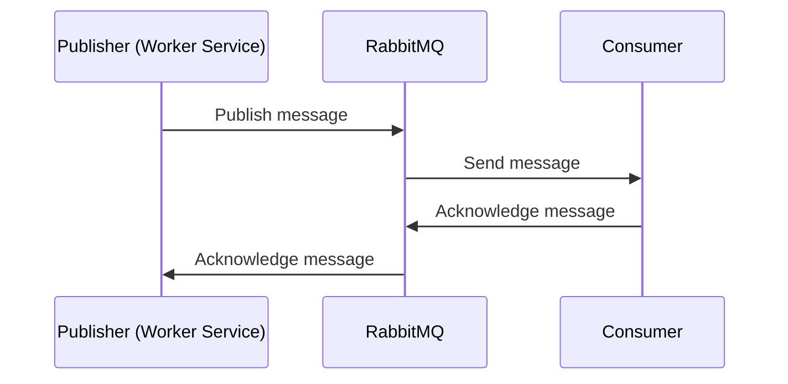

# MassTransit - RabbitMQ

## Getting Started

Run RabbitMQ

```bash
$ docker run -p 15672:15672 -p 5672:5672 masstransit/rabbitmq
```

Then signing in to RabbitMQ Management with default username and password:

- Url: http://localhost:15672
- Username: guest
- Password: guest

## Process


